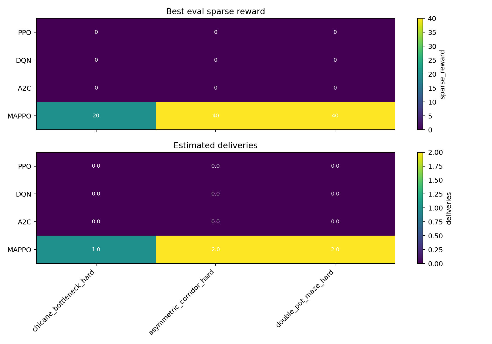
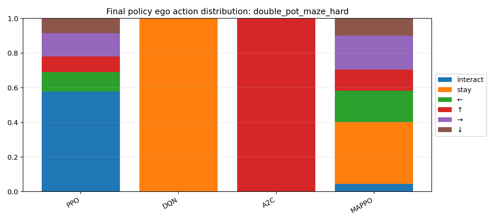
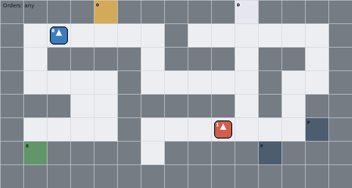

# Overcooked Multi-Agent Reinforcement Learning

## Overview

This project is the final project for multi agent system, aiming to implement RL algorithms for the Overcooked environment. The project is based on the PantheonRL library, which provides a modular and extensible framework for training agent policies, fine-tuning agent policies, ad-hoc pairing of agents, and more. 

This repository is forked from [the original PantheonRL repository](https://github.com/Stanford-ILIAD/PantheonRL), and we have implemented a gif rendering script for previewing the trained agents actions in the Overcooked environment. The script allows us to visualize the behavior of the trained agents and evaluate their performance in a more intuitive way.


## PantheonRL

PantheonRL is a package for training and testing multi-agent reinforcement learning environments. The goal of PantheonRL is to provide a modular and extensible framework for training agent policies, fine-tuning agent policies, ad-hoc pairing of agents, and more. PantheonRL also provides a web user interface suitable for lightweight experimentation and prototyping.


PantheonRL is built on top of StableBaselines3 (SB3), allowing direct access to many of SB3's standard RL training algorithms such as PPO. PantheonRL currently follows a decentralized training paradigm -- each agent is equipped with its own replay buffer and update algorithm. The agents objects are designed to be easily manipulable. They can be saved, loaded and plugged into different training procedures such as self-play, ad-hoc / cross-play, round-robin training, or finetuning.

This package will be presented as a demo at the AAAI-22 Demonstrations Program.

[Demo Paper](https://arxiv.org/abs/2112.07013)

[Demo Video](https://youtu.be/3-Pf3zh_Hpo)

```
"PantheonRL: A MARL Library for Dynamic Training Interactions"
Bidipta Sarkar*, Aditi Talati*, Andy Shih*, Dorsa Sadigh
In Proceedings of the 36th AAAI Conference on Artificial Intelligence (Demo Track), 2022

@inproceedings{sarkar2021pantheonRL,
  title={PantheonRL: A MARL Library for Dynamic Training Interactions},
  author={Sarkar, Bidipta and Talati, Aditi and Shih, Andy and Sadigh Dorsa},
  booktitle = {Proceedings of the 36th AAAI Conference on Artificial Intelligence (Demo Track)},
  year={2022}
}
```

-----

## Installation
```
# Optionally create conda environments
conda create -n overcooked python=3.7
conda activate overcooked

# downgrade setuptools for gym=0.21
pip install setuptools==65.5.0 "wheel<0.40.0"

# Clone and install
git clone https://github.com/NOIPJohnny/Overcooked
cd Overcooked
pip install -e .
```


### Overcooked Installation
```
# Optionally install Overcooked environment
git submodule update --init --recursive
pip install -e overcookedgym/human_aware_rl/overcooked_ai
```


## Command Line Invocation

The repository contains shell scripts for long-running Overcooked baseline experiments and policy visualization. Set `PYTHON_BIN` when the default `python3` is not the Overcooked conda environment.


### Main Baseline Script

`run.sh` trains and renders the standard independent-learning baselines. By default it runs PPO, DQN, and A2C on the configured Overcooked layouts.

```bash
# Train all default algorithms and layouts.
bash run.sh train

# Export GIFs for trained models.
bash run.sh gifs

# Train first, then export GIFs.
bash run.sh all

# Print the latest/best model paths found by the script.
bash run.sh latest
```

Useful overrides:

```bash
# Run only selected algorithms/layouts.
ALGORITHMS='PPO A2C' LAYOUTS='random0 unident' bash run.sh train

# Short smoke run.
TIMESTEPS=100000 EVAL_FREQ=20000 EVAL_EPISODES=5 bash run.sh all

# Re-train even if model files already exist.
FORCE=1 ALGORITHMS='A2C' LAYOUTS='unident' bash run.sh train

# Select GPU and GIF speed.
GPU_ID=0 GIF_FPS=2 bash run.sh gifs
```

The main script writes results in this structure:

```text
results/<ALGO>/<LAYOUT>/models/ego-best.zip
results/<ALGO>/<LAYOUT>/models/alt-best.zip
results/<ALGO>/<LAYOUT>/models/ego-best.eval.json
results/<ALGO>/<LAYOUT>/logs/
results/gifs/<ALGO>_<LAYOUT>.gif
results/gifs/<ALGO>_<LAYOUT>.json
```

`ego-best.zip` and `alt-best.zip` are selected by periodic evaluation success
rate. The JSON next to `ego-best.zip` stores the best step, success rate, dense
reward mean, and sparse reward mean.

### Improved DQN Script

`runDQN_improved.sh` is a script-only DQN improvement. It trains a DQN ego against a fixed PPO partner from `results/PPO/<LAYOUT>/models`. Run PPO first for the target layouts.

```bash
# Train improved DQN on the default subset of layouts.
bash runDQN_improved.sh train

# Export improved DQN GIFs.
bash runDQN_improved.sh gifs

# Train and render.
bash runDQN_improved.sh all

# Run a selected subset.
LAYOUTS='random0 scenario2 unident' bash runDQN_improved.sh all
```

The improved DQN results are stored under `results/DQN_improved/<LAYOUT>/`, and GIFs are stored as `results/gifs/DQN_improved_<LAYOUT>.gif`.

### New Hard Layouts

`run_new_levels.sh` runs the three local hard layouts without modifying the
`overcooked_ai` submodule. These layouts are registered in `overcookedgym` and
fall back to the original submodule layouts for all existing names.

```bash
# Fast validation of custom layouts and MAPPO plan-BC wiring.
bash run_new_levels.sh smoke

# Train only MAPPO plan-BC on the new layouts.
bash run_new_levels.sh train_mappo

# Train the basic baselines on the new layouts.
TIMESTEPS=500000 bash run_new_levels.sh train_baselines

# Render, evaluate, and plot any available new-layout models.
bash run_new_levels.sh gifs
bash run_new_levels.sh eval
bash run_new_levels.sh plots
```

The default new layouts are `chicane_bottleneck_hard`,
`asymmetric_corridor_hard`, and `double_pot_maze_hard`. The script evaluates
only the basic baselines (`PPO`, `DQN`, `A2C`) and `MAPPO`; it does not train or
compare `DQN_improved`.

New-layout outputs follow the existing result structure:

```text
results/<ALGO>/<LAYOUT>/models/
results/gifs/<ALGO>_<LAYOUT>.gif
results/gifs/<ALGO>_<LAYOUT>.json
results/comparison/new_levels_eval.csv
results/comparison/new_levels_eval.json
results/plots/new_levels/
```

Current 100-episode evaluation on the new layouts:

| Layout | Basic baselines | MAPPO sparse | MAPPO deliveries |
| --- | --- | ---: | ---: |
| `chicane_bottleneck_hard` | PPO/DQN/A2C all 0 success, 0 sparse | 20 | 1 |
| `asymmetric_corridor_hard` | PPO/DQN/A2C all 0 success, 0 sparse | 40 | 2 |
| `double_pot_maze_hard` | PPO/DQN/A2C all 0 success, 0 sparse; PPO reaches 34 dense shaping | 40 | 2 |

`results/plots/new_levels/final_sparse_delivery_by_layout.png` shows the
per-layout sparse reward and estimated delivery count (`sparse / 20`), which is
more informative than success rate alone on these hard layouts.

Representative visual outputs:







### Direct GIF Rendering

The GIF renderer can also be called directly for any saved model pair:

```bash
"$PYTHON_BIN" render_policy_gif.py OvercookedMultiEnv-v0 \
  --env-config '{"layout_name":"unident"}' \
  --ego-config '{"type":"PPO","location":"results/PPO/unident/models/ego-best"}' \
  --partner-config '{"type":"PPO","location":"results/PPO/unident/models/alt-best"}' \
  --output results/gifs/PPO_unident.gif \
  --actions-output results/gifs/PPO_unident.json \
  --fps 2
```

The action JSON records the dense reward, sparse reward, success flag, and ego action trace for the rendered episode.

### TensorBoard

Training logs are written under each algorithm/layout directory. The current logger keeps the key curves used for comparison: `eval/success_rate`, `eval/dense_reward_mean`, and `rollout/ep_rew_mean`.

```bash
tensorboard --logdir results --port 6006
```

## Baseline Results

The current completed baseline set contains PPO, DQN, A2C, and the script-only improved DQN baseline. Results below are from the current `results/` directory using best periodic evaluation checkpoints.

| Baseline | Layouts evaluated | Successful layouts | Summary |
| --- | ---: | ---: | --- |
| PPO | 16 | 10 | Strongest standard independent-learning baseline. It solves most medium layouts but still fails on some harder coordination layouts. |
| DQN | 16 | 0 | Standard independent DQN does not solve any layout. It sometimes receives shaping reward, but never reaches sparse success. |
| A2C | 16 | 1 | Standard independent A2C only solves `unident`. It is unstable and often collapses to simple repeated actions. |
| DQN_improved | 10 | 10 | DQN ego trained against a fixed PPO partner solves all 10 layouts tested by this script. |

PPO successful layouts:

```text
five_by_five, random0, random1, random2, scenario2, scenario2_s, schelling, schelling_s, unident, unident_s
```

PPO partial layouts with dense shaping reward but zero sparse success:

```text
random3, scenario1_s, scenario3, scenario4, small_corridor
```

DQN baseline conclusion:

Standard DQN is available through SB3 and is wired into the training, testing, evaluation, and GIF pipeline. In this independent two-agent setup it is a weak baseline for Overcooked. The failures are not evidence that the code path is broken; PPO and improved DQN solve many of the same layouts. The likely causes are sparse delayed rewards, poor exploration in the joint action space, and the non-stationarity caused by two independently learning agents.

A2C baseline conclusion:

A2C is also the standard SB3 A2C implementation. Its integration is functional: the `unident` best checkpoint reaches success rate 1.0 and remains successful when re-tested. However, A2C performs poorly on most layouts. Compared with PPO, it lacks PPO's clipped update stability, uses short default rollouts, and is more likely to collapse to repeated local actions before discovering complete task chains.

Improved DQN conclusion:

The improved DQN script changes the training setup without changing Python algorithm code. It trains DQN against a fixed PPO partner and uses more conservative DQN hyperparameters. This removes much of the multi-agent non-stationarity and makes DQN a much stronger baseline on the tested subset.

## MAPPO Full-Layout Validation

The MAPPO validation covers all 16 main layouts. There are two MAPPO model sources:

- continuous `MAPPO_plan_bc` for the six PPO-failed layouts: `corridor`, `random3`, `scenario1_s`, `scenario3`, `scenario4`, and `small_corridor`.
- PPO-to-MAPPO warm start for the ten layouts PPO already solved: `five_by_five`, `random0`, `random1`, `random2`, `scenario2`, `scenario2_s`, `schelling`, `schelling_s`, `unident`, and `unident_s`.

The hard-layout method is not pure from-scratch MAPPO. It uses decentralized MAPPO actors, a centralized critic checkpoint, and an expert-guided deterministic plan-BC lookup. The expert assigns explicit roles: one actor fills the pot with onions, and the other actor takes the dish, picks up the finished soup, and delivers it. The current expert replans from the environment's current player positions after each delivery and records a full 400-step demonstration, so the saved policy continues producing after the first successful delivery.

The latest hard-layout expert also optimizes for speed. It evaluates candidates where the serving actor prefetches a dish while the cooking actor fills the pot, and where the cooking actor moves to a parking location after filling so the serving actor can take soup without a long detour. On layouts with multiple pots, it also keeps the two-pot pipeline candidate. Candidate selection first preserves delivery count, then prefers higher speed score from earlier delivery steps.

This addresses the sparse-reward credit-assignment failure mode seen in PPO, where agents often complete cooking but fail to assign the final delivery behavior reliably. It should still be read as expert-guided MAPPO initialization/evaluation, not evidence that plain MAPPO learned these hard layouts from scratch.

The PPO-success layouts use PPO-to-MAPPO warm start rather than plan-BC. This is intentional: several of these layouts require counter handoff behavior that the simple plan-BC expert does not model. The warm-start run verifies that the MAPPO actor format, loader, renderer, and evaluator preserve PPO-level performance on layouts where PPO already succeeds, so the MAPPO extension does not regress previously solved cases.

### Reproducing MAPPO

Generate continuous plan-BC MAPPO models on the PPO-failed layouts:

```bash
FORCE=1 GPU_ID= FINAL_EVAL_EPISODES=100 PLAN_BC_MIN_DELIVERIES=2 \
LAYOUTS='corridor random3 scenario1_s scenario3 scenario4 small_corridor' \
bash runMAPPO.sh plan_bc
```

Generate PPO-warm-start MAPPO models on the PPO-success layouts:

```bash
FORCE=1 GPU_ID= EVAL_EPISODES=100 \
LAYOUTS='five_by_five random0 random1 random2 scenario2 scenario2_s schelling schelling_s unident unident_s' \
bash runMAPPO.sh warmstart
```

Run the full PPO vs MAPPO evaluation:

```bash
"$PYTHON_BIN" evaluate_saved_models.py \
  --episodes 100 \
  --layouts corridor five_by_five random0 random1 random2 random3 scenario1_s scenario2 scenario2_s scenario3 scenario4 schelling schelling_s small_corridor unident unident_s \
  --algorithms PPO MAPPO \
  --output-csv results/comparison/mappo_all_eval.csv \
  --output-json results/comparison/mappo_all_eval.json
```

Run the hard-layout speed check:

```bash
"$PYTHON_BIN" evaluate_saved_models.py \
  --episodes 100 \
  --layouts corridor random3 scenario1_s scenario3 scenario4 small_corridor \
  --algorithms PPO MAPPO \
  --output-csv results/comparison/mappo_hard_speed_eval.csv \
  --output-json results/comparison/mappo_hard_speed_eval.json
```

Generate GIFs, action traces, and plots:

```bash
LAYOUTS='corridor five_by_five random0 random1 random2 random3 scenario1_s scenario2 scenario2_s scenario3 scenario4 schelling schelling_s small_corridor unident unident_s' \
bash runMAPPO.sh gifs

MPLCONFIGDIR=/data/luoey/tmp/matplotlib \
LAYOUTS='corridor five_by_five random0 random1 random2 random3 scenario1_s scenario2 scenario2_s scenario3 scenario4 schelling schelling_s small_corridor unident unident_s' \
bash runMAPPO.sh plots
```

### MAPPO Results

The core metrics are eval `success_rate` and sparse reward over 100 episodes. Full results are stored in `results/comparison/mappo_all_eval.csv`; hard-layout speed results are stored in `results/comparison/mappo_hard_speed_eval.csv`. PPO solves 10/16 layouts; MAPPO solves 16/16. On the ten PPO-success layouts, MAPPO preserves the PPO success rate and sparse reward.

| Layout | MAPPO source | PPO success | MAPPO success | PPO sparse | MAPPO sparse |
| --- | --- | ---: | ---: | ---: | ---: |
| corridor | speed_plan_bc | 0.0 | 1.0 | 0.0 | 40.0 |
| five_by_five | ppo_warmstart | 1.0 | 1.0 | 280.0 | 280.0 |
| random0 | ppo_warmstart | 1.0 | 1.0 | 220.0 | 220.0 |
| random1 | ppo_warmstart | 1.0 | 1.0 | 200.0 | 200.0 |
| random2 | ppo_warmstart | 1.0 | 1.0 | 220.0 | 220.0 |
| random3 | speed_plan_bc | 0.0 | 1.0 | 0.0 | 100.0 |
| scenario1_s | speed_plan_bc | 0.0 | 1.0 | 0.0 | 140.0 |
| scenario2 | ppo_warmstart | 1.0 | 1.0 | 220.0 | 220.0 |
| scenario2_s | ppo_warmstart | 1.0 | 1.0 | 220.0 | 220.0 |
| scenario3 | speed_plan_bc | 0.0 | 1.0 | 0.0 | 140.0 |
| scenario4 | speed_plan_bc | 0.0 | 1.0 | 0.0 | 140.0 |
| schelling | ppo_warmstart | 1.0 | 1.0 | 140.0 | 140.0 |
| schelling_s | ppo_warmstart | 1.0 | 1.0 | 240.0 | 240.0 |
| small_corridor | speed_plan_bc | 0.0 | 1.0 | 0.0 | 60.0 |
| unident | ppo_warmstart | 1.0 | 1.0 | 420.0 | 420.0 |
| unident_s | ppo_warmstart | 1.0 | 1.0 | 460.0 | 460.0 |

For the six hard plan-BC layouts, the saved action JSONs confirm faster repeated deliveries across the full 400-step episode:

| Layout | Expert mode | Previous success steps | New success steps | Delivery change | MAPPO sparse | Ego/Alt non-stay actions |
| --- | --- | --- | --- | ---: | ---: | ---: |
| corridor | two_pot_pipeline | 178, 378 | 179, 328 | 2 -> 2 | 40.0 | 270 / 99 |
| random3 | prefetch_single_pot_loop | 90, 184, 278, 372 | 70, 145, 220, 295, 370 | 4 -> 5 | 100.0 | 265 / 119 |
| scenario1_s | prefetch_single_pot_loop | 56, 120, 184, 248, 312, 376 | 54, 111, 168, 225, 282, 339, 396 | 6 -> 7 | 140.0 | 253 / 96 |
| scenario3 | prefetch_single_pot_loop | 68, 136, 204, 272, 340 | 52, 103, 154, 205, 256, 307, 358 | 5 -> 7 | 140.0 | 170 / 178 |
| scenario4 | prefetch_single_pot_loop | 71, 137, 203, 269, 335 | 67, 118, 169, 220, 271, 322, 373 | 5 -> 7 | 140.0 | 190 / 178 |
| small_corridor | prefetch_single_pot_loop | 118, 251, 384 | 110, 223, 336 | 3 -> 3 | 60.0 | 337 / 107 |

`random3`, `scenario1_s`, `scenario3`, and `scenario4` now reach 5-7 deliveries in 400 steps. `small_corridor` keeps 3 deliveries but moves every delivery earlier. `corridor` still reaches 2 deliveries, but the second delivery moves from step 378 to step 328 through the two-pot pipeline candidate; the first delivery is one step later, so the improvement is throughput/interval rather than first-delivery latency. These corridor layouts remain lower-throughput because the topology forces long repeated onion-to-pot and soup-to-serving trips.

Generated MAPPO artifacts:

```text
results/MAPPO/<LAYOUT>/models/ego-best.pt
results/MAPPO/<LAYOUT>/models/alt-best.pt
results/MAPPO/<LAYOUT>/models/ego-best.eval.json
results/comparison/mappo_all_eval.csv
results/comparison/mappo_hard_speed_eval.csv
results/gifs/MAPPO_<LAYOUT>.gif
results/gifs/MAPPO_<LAYOUT>.json
results/plots/learning_curves_success_rate.png
results/plots/final_success_rate.png
results/plots/final_dense_sparse_reward.png
results/plots/action_distribution_<LAYOUT>.png
```
